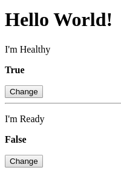
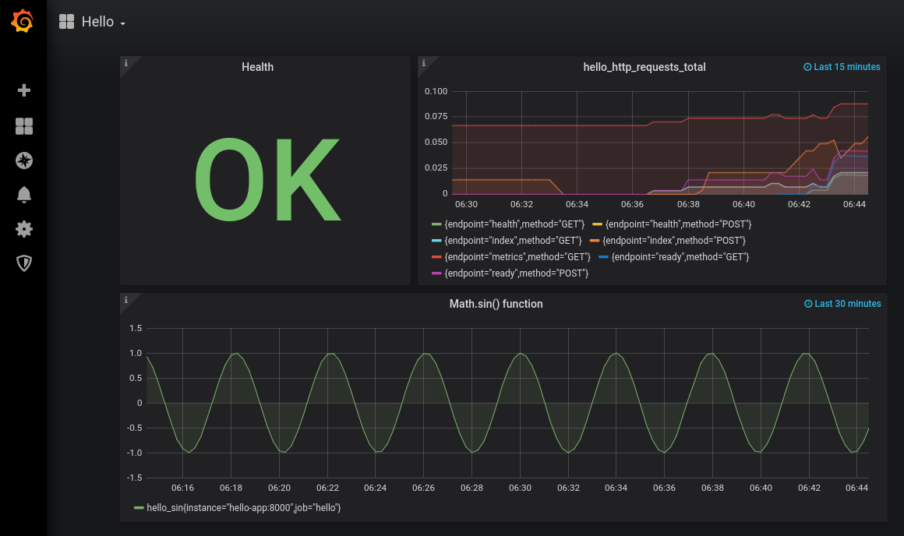

## Hello_project
Hello web application exports metric to Prometheus and Grafana, working in Kubernetes or Docker Swarm

Тестовое задание: реализовать "Привет Мир" HTTP-приложение, которое отдает метрики в Prometheus. Метрики визуализируются в Grafana

__hello-app__ (TCP port 8000) -> __Prometheus__ (TCP port 9090) -> __Grafana__ (TCP port 3000)  

### ./hello_app - приложение на языке  Python (Django).  
Хранит состояние здоровья и готовности, которые можно изменять через web-интерфейс (javascript AJAX), формирует метрики.  

Запуск приложения - `manage.py runserver [address_to_bind:port_number]`  
По умолчанию стартует и доступно по адресу ***http://localhost:8000***  
Образ приложения строится с помощью [Dockerfile](hello_app/hello_project/Dockerfile).  
##### endpoints:  
/ - основная страница, отображает состояние приложения и позволяет его изменять.  
/ready - проверка готовности приложения  
/health - проверка здоровья приложения  
/metrics - тестовые метрики (состояние здоровья, счетчик запросов, синусоида и бонусом метрики от библиотеки client_python).   
Метрики формируются как с использованием [Prometheus Python Client](https://github.com/prometheus/client_python), так и самостоятельно.  
Backend (код Python) находится в [views.py](hello_app/hello_project/hello_app/views.py)  
Frontend (HTML+JavaScript) - [index.html](hello_app/hello_project/hello_app/templates/index.html)  
Скриншот приложения:  

### Запуск в Kubernetes  
Текущая конфигурация тестировалась в кластере [Google Kubernetes Engine](https://cloud.google.com/kubernetes-engine) состоящем из трех нод.    
Образ Hello-app приложения можно загрузить с [Docker Hub](https://hub.docker.com/repository/docker/vasily22/hello)  
Для Prometheus используется стандартный образ, без изменений [prom/prometheus:v2.17.1](https://hub.docker.com/r/prom/prometheus)  
Grafana также стартует из стандартного образа [grafana/grafana:6.7.2](https://hub.docker.com/r/grafana/grafana)  
ConfigMap c конфигурацией Prometheus монтируeтся по стандартному пути _/etc/prometheus/prometheus.yaml_  
Графана конфигурируется (DataSource & Dashboard) с помощью механизма Provisioning. (ConfigMaps в _/etc/grafana/provisioning, /etc/grafana/dashboards_)  
В результате Datasource импортируется в БД с признаком read_only.  
(При необходимости это легко исправить напрямую в БД утилитой _sqlite3_).  
Запуск кластера осуществляется командой `kubectl apply -f ./kubernetes`  
Ingress активируется через несколько минут. Для доступа к приложениям необходимо прописать виртуальные хосты в файл _/etc/hosts_:  
_34.95.79.24 hello-app.com hello-prometheus.com hello-grafana.com_  
_34.95.79.24_ - IP адрес из команды `kubectl get ingress`  
Дальнейший доступ к Hello-app, Prometheus, Grafana осуществляется с помощью браузера через стандартный порт 80 по адресам _hello-app.com, hello-prometheus.com, hello-grafana.com,_ соответственно.
### Запуск в Docker Swarm
docker-compose.yaml и файлы конфигурации приложений находятся в каталоге [compose](compose)  
Текущая конфигурация работает с Docker Swarm и не работает с 
[Docker-compose](https://github.com/docker/compose/issues/5110)    
Конфигурация тестировалась с Docker Server Version: 19.03.8-ce на кластере с одной нодой.    
Запуск кластера - `cd compose; docker stack deploy --compose-file docker-compose.yaml hello`  
Подключиться к сервисам можно введя в браузере адрес 127.0.0.1 и соответствующий номер порта.  
Конфигурация микросервисов такая же как и в случае с Kubernetes.  
    
 В результате должны получить дашборд подобный следующему:
 

